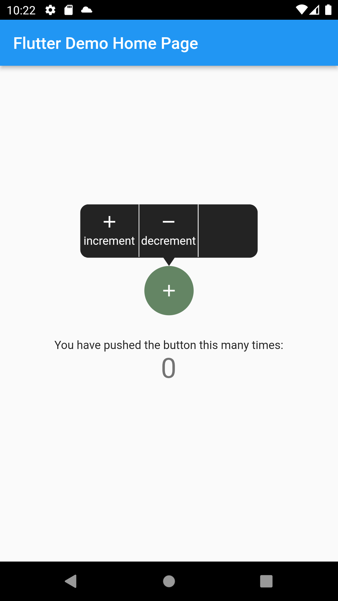

# Youtube Player IFrame
**SCREENSHOT** 




a pupup menu, for porpose not break the user attention


Supported Platforms:
- **ALL** 

#### Using the Popup menu 2

```dart
ContextualMenu(
    globalKey: GlobalKey(),
    items: [
    MenuItem(
        press: _incrementCounter,
        title: 'increment',
        textAlign: TextAlign.justify,
        textStyle: const TextStyle(color: Colors.white),
        image: const Icon(Icons.add, color: Colors.white),
    ),
    MenuItem(
        press: _decrementCounter,
        title: 'decrement',
        textAlign: TextAlign.justify,
        textStyle: const TextStyle(color: Colors.white),
        image: const Icon(Icons.remove, color: Colors.white),
    ),
    ],
    child: Container(
    height: 60,
    width: 60,
    decoration: const BoxDecoration(
        shape: BoxShape.circle,
        color: Color(0xff648564),
    ),
    child: const Icon(Icons.add, color: Colors.white),
    ),
),

```


## License
```
Copyright (c) 2022, youmti.net
All rights reserved.

Redistribution and use in source and binary forms, with or without modification.
